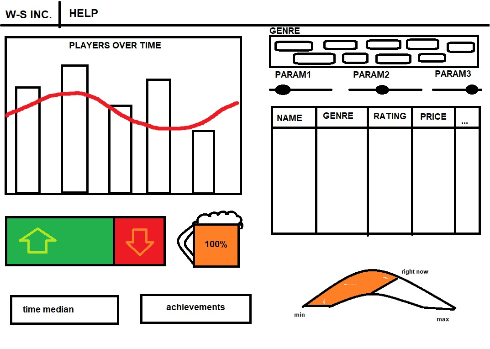

# Games Analiser
*Radosław Winiecki & Oskar Szudzik*

## Application domain

Our application is designed for video game enjoyers. Our goal was to present an overview of the gaming market and suggest titles they may like.

## Source datasets

Datasets we used:
* https://www.kaggle.com/datasets/michau96/popularity-of-games-on-steam
* https://www.kaggle.com/datasets/nikdavis/steam-store-games?select=steamspy_tag_data.csv

## Set of tasks to be accomplished

* browse available games in a data table
* filter other charts by clicking on a table row
* display total number of players for each game
* show the ratio of currently playing people to all time high
* suggest a game based on positive rating threshold and preferred genre
* present sales chart of game developers

## Dashboard sketch

## Live demo link

...